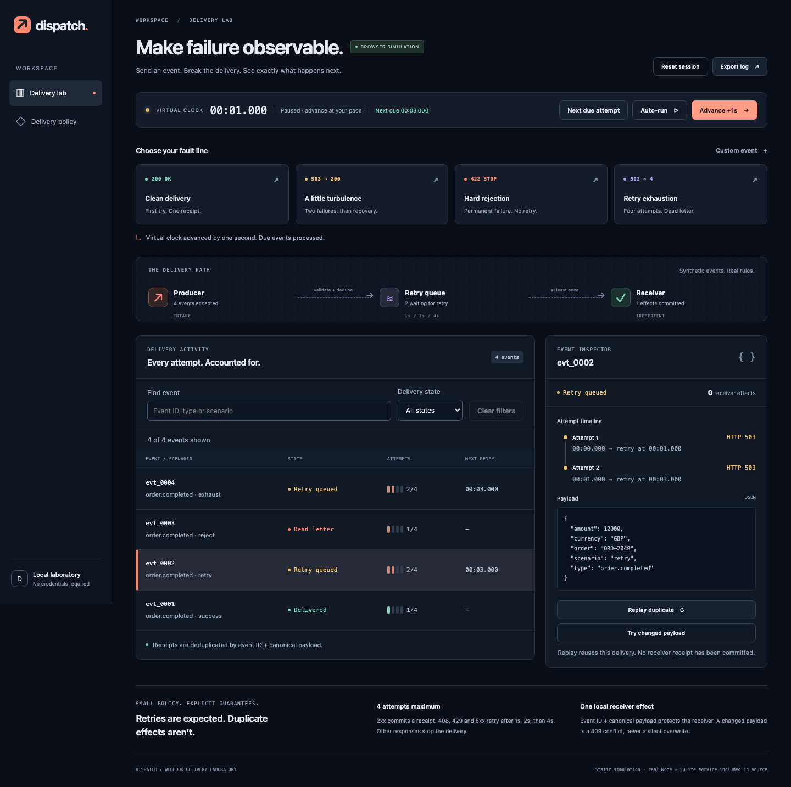

# Dispatch

**Make failure observable.** A webhook delivery laboratory with a visual retry console and an independently runnable Node/SQLite service. Watch a failed delivery recover, replay a duplicate, and inspect the precise boundary between a transport attempt and a receiver effect.



[View the mobile console](docs/screenshots/mobile.png)

**[Open the live demo](https://nen-io.github.io/dispatch-webhook-lab/)** · [CI checks](https://github.com/nen-io/dispatch-webhook-lab/actions)

## Try it locally

Requires Node **24.19+** and npm. This project uses the built-in `node:sqlite` module; Node 24.19 marks that API as a release candidate (stability 1.2), so API changes remain a consideration. The browser demo needs no service, login, credentials, fonts or external assets.

```sh
npm ci
npm run dev
```

Open `http://127.0.0.1:4303`. The page is explicitly a **browser simulation**, driven by the same retry/idempotency policy as the included service. Refresh starts a fresh sample; reset clears it. Nothing is sent to a server.

1. Four seeded events show success, recovery, permanent rejection and exhaustion.
2. Advance three seconds: the recovering event receives HTTP 200 on attempt 3.
3. Select `evt_0002`, then **Replay duplicate**. Its original receipt and one receiver effect remain.
4. **Try changed payload** produces an explicit 409 conflict.
5. Advance to seven seconds to exhaust the persistent failure. Export the JSON event log.
6. Try a custom ID and JSON payload, or reset for an empty queue.

Auto-run advances one virtual second per browser timer callback. Background tab throttling does **not** advance by elapsed wall time; the displayed virtual clock is authoritative.

## Real HTTP service

```sh
npm run service
```

The service binds **127.0.0.1:4403**, stores `data/dispatch.sqlite`, and processes due work only when explicitly asked. Use one process per database file. The static UI deliberately has no API mode or fake connected badge.

```sh
curl -s http://127.0.0.1:4403/health
curl -s http://127.0.0.1:4403/events \
  -H 'Content-Type: application/json' \
  -d '{"id":"order-1","payload":{"type":"order.completed","scenario":"retry"}}'
curl -s http://127.0.0.1:4403/process \
  -H 'Content-Type: application/json' -d '{}'
curl -s http://127.0.0.1:4403/events
```

For the retry scenario, call `/process` after at least one more real second, then after two more seconds. Stop with Ctrl+C and restart to keep pending work and receipts. API examples use synthetic data only. All requests with an `Origin` header are rejected; this API is for local CLI use, not a browser cross-origin connection.

| Route       | Method | Behavior                                                        |
| ----------- | ------ | --------------------------------------------------------------- |
| `/health`   | GET    | 200 health and explicit lab scope                               |
| `/events`   | POST   | 201 new receipt, 200 identical duplicate, 409 changed payload   |
| `/events`   | GET    | Events, recorded attempts, due times and effect counts          |
| `/process`  | POST   | Body `{}`; process one due attempt per event, serially          |
| `/receiver` | POST   | Internal fixed HTTP destination; requires a process-local token |

Event body is exactly `{ "id": string, "payload": nonempty object }`. IDs contain 1–64 ASCII letters/digits/dots/dashes/underscores, start alphanumeric; envelope limit 32 KiB, nesting limit 16. Optional `payload.scenario` is `success`, `retry`, `reject` or `exhaust`. Omit it for success. No caller-controlled destination URL is accepted. Unknown routes return 404, wrong methods 405, invalid JSON 400, excessive bodies 413 and unsupported encodings/content types 415.

## What this demonstrates

- Deterministic retry policy: 2xx success; 408/429/5xx and transport errors retry after 1s/2s/4s; other responses stop; at most four recorded logical attempts.
- Canonical nested JSON idempotency, including numeric and prototype-like property names.
- SQLite transactions coupling receiver receipts to one synthetic local effect.
- Durable attempt reservation before actual loopback HTTP delivery; crash replay after receiver commit without reapplying an effect.
- Bounded input, strict HTTP host/origin checks, explicit errors, serial processing and shutdown.
- Responsive keyboard-operable UI, reduced-motion support and text-safe payload inspection.

**Guarantee boundary:** transport is at least once. A crash can replay the same reserved attempt, so physical sends can exceed four; normal policy allows four logical attempts. The local SQLite receiver effect is deduplicated in one transaction. This is not an exactly-once guarantee for arbitrary external side effects.

## Scripts

| Command             | Purpose                                                     |
| ------------------- | ----------------------------------------------------------- |
| `npm run dev`       | Static demo at 4303                                         |
| `npm run service`   | Real local service at 4403                                  |
| `npm run typecheck` | Strict TypeScript checking, including service/tests         |
| `npm test`          | Policy/reducer and actual HTTP/SQLite integration tests     |
| `npm run build`     | Typecheck and relative-base static build                    |
| `npm run format`    | Format source, tests and documentation with pinned Prettier |
| `npm run check`     | Typecheck, tests and production build                       |
| `npm run test:e2e`  | Chromium journeys and actual desktop/mobile screenshots     |

Install the matching browser once with `npx playwright install chromium` before browser tests. GitHub Pages uses relative build assets, allowing a repository subpath. The GitHub Actions workflow verifies the app before deploying the static build.

## Deliberate limits

100 events per browser session or service database, four logical attempts per event, 32 KiB input, 16 JSON levels and 32 concurrent HTTP connections. No authentication, TLS, distributed worker coordination, background daemon, arbitrary destinations, imported files, analytics or provider credentials. The synchronous SQLite service is a single-process teaching lab. It is **not** suitable for internet exposure. No production throughput or availability is claimed.

Implementation and documentation were developed with AI assistance and reviewed through executable tests and independent project review. This repository is a new demonstration; it contains no private product source, employer code, personal records or claims of historical production use.

## Engineering notes

- [Architecture and action walkthrough](docs/ARCHITECTURE.md)
- [Design and responsive behavior](docs/DESIGN.md)
- [Security model and residual risks](docs/SECURITY.md)
- [Scalability boundaries](docs/SCALABILITY.md)
- [Six architectural decisions](docs/DECISIONS.md)
- [Test evidence and reproducible crash/restart checks](docs/TESTING.md)
- [Asset provenance](docs/ASSETS.md)

MIT licensed. See [LICENSE](LICENSE).

## Exploration refinements

Use **Next due attempt** to step through exact backoff boundaries. Search/filter the ledger to focus on a scenario or state; processing and JSON export always retain the full queue. The inspector keeps its selected event with an explicit notice if that event leaves your filter. Pending/dead duplicate messages distinguish their existing delivery from a committed receiver receipt.
