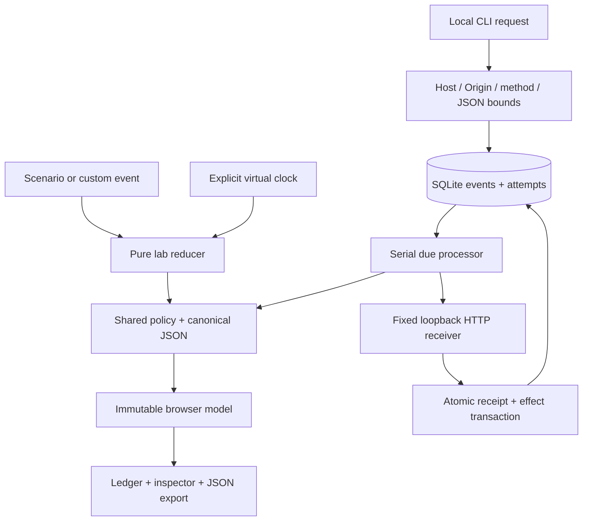

# Architecture

## The two execution paths

Dispatch has a browser-only simulation and a separately started local HTTP service. They share validation, canonical payload identity and retry classification. The simulator records effects as deterministic state; the service actually sends HTTP and commits effects in SQLite. The UI never reports service connectivity.

## Concrete browser action

Selecting “A little turbulence” dispatches `seed` into `labReducer`. The reducer computes a free generated ID against its latest state, calls `enqueue` with the current virtual timestamp, and runs `processDue` at that same time. Shared policy returns 503 on the first attempt and schedules the next attempt at +1000ms. A new immutable simulation replaces the prior one. The ledger derives pending counts and attempt bars; the inspector renders the selected payload as DOM text. Advancing time dispatches another ordered reducer action, so a clock tick cannot be overwritten by a stale enqueue closure. No localStorage or network side effect occurs. Export writes the current rendered model into a version 1 JSON Blob.

## Concrete service action

`POST /events` passes exact Host, absent Origin, method, content-type, UTF-8, byte, shape, depth and ID validation. Inside an immediate SQLite transaction, canonical payload equality returns an existing receipt, a differing payload throws 409, or a new event is inserted. `POST /process {}` shares any running processor promise. Each due event reserves an attempt in a committed transaction, performs actual HTTP to the service's fixed `/receiver`, then commits response status and the next schedule together. Receiver success inserts the receipt and effect in a single transaction. Delivery failure classification uses the same `outcome` function as the UI.

## Module map

| Module                            | Responsibility                                                                                         |
| --------------------------------- | ------------------------------------------------------------------------------------------------------ |
| `src/domain/policy.ts`            | `validateInput`, `canonical`, `outcome`, `scenarioStatus`, `enqueue`, `processDue` and explicit bounds |
| `src/domain/simulation.ts`        | Virtual clock, collision-free scenario IDs, seeded sample                                              |
| `src/domain/lab.ts`               | Ordered UI state transitions and recoverable error messages                                            |
| `src/components/Ledger.tsx`       | Selectable delivery rows and status presentation                                                       |
| `src/components/Inspector.tsx`    | Response timeline, payload text and duplicate actions                                                  |
| `src/components/DeliveryLane.tsx` | Derived producer/queue/receiver counts                                                                 |
| `src/App.tsx`                     | Interaction wiring, interval cleanup and export                                                        |
| `server/store.ts`                 | Schema version 1, prepared SQL, atomic transactions and durable attempts                               |
| `server/service.ts`               | Actual HTTP boundary, serial process coordinator and fixed receiver                                    |
| `server/main.ts`                  | Port 4403 entrypoint and graceful termination                                                          |

## Persistence and crash semantics

SQLite uses WAL, `synchronous=FULL`, foreign keys and schema `user_version=1`; unknown nonzero schema versions fail startup. Events, attempts, receipts and effects are separate tables. Receipt primary keys and a same-transaction effect insertion preserve local deduplication. Receipt identity uses the full canonical payload, not a collision-prone hash. No transaction spans an `await`.

| Interruption point                                 | Recovery                                                                      |
| -------------------------------------------------- | ----------------------------------------------------------------------------- |
| Before attempt reservation commit                  | Event remains due; next run reserves attempt                                  |
| After reservation, before receiver effect          | Replay existing unfinished logical attempt                                    |
| After receiver commit, before sender result commit | Replay same attempt; receiver returns original receipt without another effect |
| After sender result/schedule commit                | Completed attempt and next due time persist together                          |

An unfinished attempt has `status:null`. A network error has recorded `status:0`. They are different states. Four is a logical policy-attempt limit, not a physical transport-send limit across repeated crashes. Synthetic receiver responses are deterministic by payload scenario and logical attempt number.

Each process must exclusively own its SQLite file. The API serializes overlapping process requests in one process; it does not implement a distributed lease protocol. The included in-process guard rejects two instances given the same path string, but does not act as an OS-wide lock. External modification of the database is outside the trust boundary.

## Current official documentation consulted

Checked 17 September 2026:

- [React: avoiding unnecessary effects](https://react.dev/learn/you-might-not-need-an-effect) — derive UI from state; effect reserved for interval lifecycle.
- [Vite: static deployment](https://vite.dev/guide/static-deploy.html) — relative `base: './'` and static output.
- [Node 24: SQLite](https://nodejs.org/download/release/latest-v24.x/docs/api/sqlite.html) — built-in synchronous statements and transaction behavior; release-candidate API since Node 24.15.
- [Vitest guide](https://vitest.dev/guide/) — standalone runner, excluding Playwright test files.
- [Playwright web server](https://playwright.dev/docs/test-webserver) — test-owned local server and reproducible browser tests.
- [Prettier installation](https://prettier.io/docs/install) — exact formatter version for reproducible source style.
- [MDN Origin header](https://developer.mozilla.org/en-US/docs/Web/HTTP/Reference/Headers/Origin) — browser-origin boundary, including opaque `null` origins.

Exact dependencies are resolved in `package-lock.json`. Node 24.19 was used locally. Dependency audit output is only one package-advisory signal, not a security audit.
